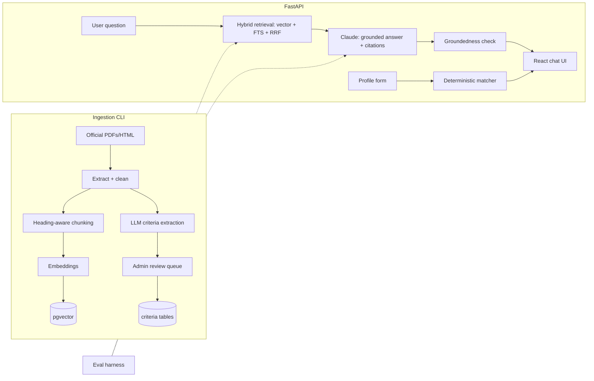

# Sahayak — Architecture & Design

> Multilingual RAG assistant for discovering Indian government welfare schemes, with citation-grounded answers and a deterministic eligibility engine.
> Companion docs: [plan.md](plan.md) (product vision), [IMPLEMENTATION.md](IMPLEMENTATION.md) (phased task list for the building agent).

---

## 1. System overview

Two planes:

- **Offline ingestion plane** (CLI, run on corpus updates): official scheme PDFs/HTML → cleaned text → heading-aware chunks → embeddings in pgvector; in parallel, LLM extracts structured eligibility criteria into review-gated rule tables.
- **Online serving plane** (FastAPI): hybrid retrieval (vector + full-text + RRF) → Claude generates a grounded, cited answer → a groundedness-verification pass flags unsupported sentences → React UI renders answer + citation panel. Separately, an eligibility profile form is matched **deterministically** against reviewed criteria rules (no LLM at match time).



## 2. Tech stack (fixed — do not substitute)

| Layer | Choice | Notes |
|---|---|---|
| API | Python 3.12, FastAPI, SQLAlchemy 2.x (async), Pydantic v2 | uvicorn; alembic for migrations |
| DB | PostgreSQL 16 + pgvector | one DB for vectors, FTS, and relational data |
| LLM | Claude API (`anthropic` SDK) | Sonnet-class model for user answers; Haiku-class (`claude-haiku-4-5-20251001`) for extraction, translation, judging |
| Embeddings | Voyage AI (`voyage-3.5`, 1024-dim) or equivalent hosted embedding API; abstract behind an `Embedder` interface | dimension pinned at 1024 in schema |
| Frontend | React 18 + TypeScript + Vite, Tailwind CSS | plain fetch/React Query; no heavy state library |
| Infra | Docker Compose (db, api, web); Makefile as task runner | CI: GitHub Actions (lint, test, eval smoke) |
| Ingestion | `pypdf`/`pdfplumber` for PDFs, `trafilatura`/BeautifulSoup for HTML | tables converted to markdown |

Repo layout (monorepo):

```
sahayak/
  api/          # FastAPI app: routers/, services/, models/, db/, llm/
  ingest/       # CLI pipeline: fetch, clean, chunk, embed, extract_criteria
  eval/         # golden set (YAML), harness, judges, EVALS.md generator
  web/          # React app
  infra/        # docker-compose.yml, Dockerfiles, alembic
  Makefile      # make up / ingest / eval / test / lint
  .env.example  # ANTHROPIC_API_KEY, VOYAGE_API_KEY, DATABASE_URL
```

## 3. Data model (PostgreSQL)

```sql
schemes(id PK, name, state, ministry, category, summary, official_url, status)  -- status: active|stale|draft
documents(id PK, scheme_id FK, title, source_url, doc_type, lang, fetched_at, checksum)  -- checksum → idempotent ingest
chunks(id PK, document_id FK, seq, heading_path text, text, tokens int,
       embedding vector(1024), tsv tsvector)                     -- GIN index on tsv, HNSW/IVF on embedding
criteria(id PK, scheme_id FK, field, op, value, source_quote, confidence float,
         status text, reviewed_by, reviewed_at)                  -- status: pending|approved|rejected
profiles(id PK, session_id, answers_json jsonb, created_at)      -- anonymous; NO PII beyond form fields
matches(profile_id FK, scheme_id FK, verdict, missing_criteria_json jsonb, rank)
qa_logs(id PK, session_id, question, lang, retrieved_chunk_ids int[], answer,
        citations_json jsonb, groundedness_json jsonb, latency_ms, tokens_in, tokens_out)
eval_cases(id PK, question, gold_answer, gold_chunk_ids int[], category)
eval_runs(id PK, git_sha, ts, recall_at_5, citation_precision, faithfulness, notes)
```

Criteria vocabulary — `field` ∈ {`min_age`, `max_age`, `max_annual_income`, `state`, `occupation`, `gender`, `category` (SC/ST/OBC/General), `disability`, `max_land_holding_acres`, `bpl_card`}; `op` ∈ {`<=`, `>=`, `==`, `in`}. Only `status='approved'` criteria participate in matching.

## 4. Core pipelines

### 4.1 Ingestion (`ingest/`)
1. **Fetch**: download from source URL (respect robots; only open portals like myscheme.gov.in). Store raw file + checksum; skip unchanged checksums (idempotency).
2. **Clean**: PDF → text with layout awareness; tables → markdown tables; strip headers/footers/page numbers.
3. **Chunk**: heading-aware splitter — split on heading boundaries, target 400–800 tokens, ~15% overlap, never split a table; store `heading_path` (e.g. "PM-KISAN > Eligibility > Exclusions").
4. **Embed**: batch-embed chunks; write `embedding` + `tsv` (`to_tsvector('english', text)`).
5. **Extract criteria**: Haiku-class model with a JSON-schema-constrained tool call returns `{field, op, value, source_quote, confidence}[]`; rows land as `status='pending'` for admin review. `source_quote` MUST be a verbatim substring of the document text — validate programmatically; reject otherwise.

### 4.2 Hybrid retrieval (`api/services/retrieval.py`)
- Vector: cosine top-20 from pgvector (query embedded with same model).
- FTS: `ts_rank_cd` top-20 via `websearch_to_tsquery`.
- Merge with **Reciprocal Rank Fusion**: `score(d) = Σ 1/(60 + rank_i(d))`; return top-k (default 8).
- Optional metadata filters (state, category) applied in both branches' SQL.
- Non-English query → translate to English first (Haiku-class), retrieve, note original language for the answer pass.

### 4.3 Grounded answering (`api/services/chat.py`)
- System prompt: answer **only** from the numbered context chunks; every factual sentence carries `[n]` citations; if the context doesn't cover it, reply exactly with the refusal message ("I don't have this information in the official documents I've indexed."); answer in the user's language.
- Response is parsed into sentences + citation lists; each citation maps to `{chunk_id, source_url, heading_path}` for the UI panel.

### 4.4 Groundedness check (`api/services/groundedness.py`)
- Second pass, Haiku-class: for each answer sentence with citations, judge whether the cited chunk(s) actually entail the sentence → `supported | partial | unsupported` per sentence.
- Result stored in `qa_logs.groundedness_json`; UI shows a warning badge on `partial`/`unsupported` sentences. This pass must not rewrite the answer — it only annotates.

### 4.5 Deterministic eligibility matcher (`api/services/matcher.py`)
- Pure function: `match(profile_answers, approved_criteria) → {verdict, satisfied[], failed[], unknown[]}` per scheme.
- Verdicts: `eligible` (all criteria pass), `possibly_eligible` (some fields unanswered), `not_eligible` (≥1 criterion fails — record which, to power "you'd qualify if…").
- Ranking: eligible first (by fewest unknowns), then possibly_eligible. **No LLM call anywhere in this path.** An optional LLM pass may phrase the explanation text, but verdicts come only from the rule engine.

### 4.6 Eval harness (`eval/`)
- Golden set: 50+ YAML cases `{question, gold_answer, gold_chunk_ids | gold_doc+quote, category}` including out-of-corpus questions whose gold answer is the refusal.
- Metrics: **Recall@5** (retrieval), **citation precision** (cited chunks ⊆ relevant), **faithfulness** (LLM-as-judge, pinned rubric + pinned model, temperature 0).
- `make eval` runs all metrics, appends a row to `EVALS.md` with git SHA + date, and writes `eval_runs`. CI runs a 10-case smoke subset.

## 5. API surface (FastAPI, `/api/v1`)

| Method & path | Purpose |
|---|---|
| `POST /chat` | `{question, lang?, filters?}` → `{answer, sentences:[{text, citations[], groundedness}], citations:[{n, chunk_id, source_url, heading_path, quote}], usage}` |
| `GET /search` | raw hybrid retrieval (debug/chunk-browser) |
| `POST /profiles` | submit eligibility form → profile id |
| `GET /profiles/{id}/matches` | ranked matches with verdicts + gap explanations |
| `GET /schemes`, `GET /schemes/{id}` | scheme catalog |
| `GET /admin/criteria?status=pending` | review queue |
| `POST /admin/criteria/{id}/review` | approve/reject/edit |
| `GET /health` | liveness + DB check |

Admin routes gated by a simple `ADMIN_TOKEN` header (portfolio scope — document as such).

## 6. Key design decisions (rationale — keep these in README)

1. **pgvector over a dedicated vector DB** — corpus ≈ 10⁵ chunks; one transactional store for vectors + metadata + FTS. Qdrant is the documented 10⁷ path.
2. **LLM extracts rules once (human-reviewed); deterministic code matches profiles** — eligibility answers are reproducible and auditable. The LLM is never asked "is this user eligible" at runtime.
3. **Groundedness is a first-class feature** — verification pass + UI badges + eval metric. This is the differentiator from toy RAG.
4. **Cost tiering** — Haiku-class for extraction/translation/judging; Sonnet-class only for user-facing answers. Token usage logged per request in `qa_logs`.
5. **Query translation over multilingual embeddings** for cross-lingual retrieval (implement translation first; benchmark and document the tradeoff in EVALS.md).

## 7. Non-functional constraints

- **Privacy**: profiles anonymous; never store government IDs; no PII in logs.
- **Honesty**: refusal path is mandatory; never let the model answer from parametric knowledge.
- **Idempotency**: re-running ingestion must not duplicate chunks (checksum gate).
- **Config**: all secrets via env (`.env` gitignored, `.env.example` committed).
- **Testing**: unit tests for chunker, RRF merge, matcher (pytest); matcher tests must cover boundary values and "would qualify if" gaps.
