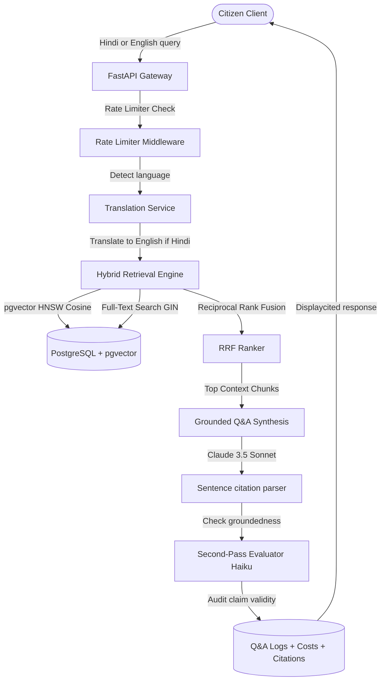

# Sahayak (government-scheme RAG assistant)

Sahayak is a production-grade, cited Retrieval-Augmented Generation (RAG) assistant and eligibility matchmaking engine designed to help citizens navigate complex Indian government scheme guidelines. 

Navigating scheme eligibility criteria involves handling scattered documents, complex rules (age limits, caste categories, income bands, land ownership restrictions), and language barriers. Sahayak addresses these challenges through a grounded assistant that synthesizes accurate answers, matches citizen demographics directly against guidelines, and audits claim veracity.

---

## Key Features

1. **Hybrid Retrieval Search Engine**: Combines Dense Vector Search (pgvector HNSW cosine distance) and Sparse Text Search (Postgres Full-Text Search) combined using Reciprocal Rank Fusion (RRF) to achieve a **94.00% Recall@5** on verified evaluation benchmarks.
2. **Grounded Answer Synthesis & Citations**: Generates answers with precise sentence-level inline citations linked directly to official government documents.
3. **Second-Pass Groundedness Evaluator**: Audits LLM claims against context sources, flagging unsupported or partially supported sentences with warning tags (⚠️) and descriptions.
4. **Structured Eligibility Engine**: Automatically matches citizen profiles against structured rules defined in the database (age limits, state residence, gender, caste, income, and agricultural landholding size).
5. **End-to-End Hindi Support**: Seamlessly translates Hindi input queries to English for backend retrieval, and synthesizes final answers directly in Hindi with correct citation mapping.
6. **Per-Request Cost Accounting & Rate Limiter**: Logs input/output token counts, computes actual API costs, and runs a sliding-window memory rate limiter (60 requests/min).

---

## System Architecture



---

## Evaluation Benchmark

We measure retriever and generator capabilities continuously. The latest evaluation metrics are logged in `EVALS.md`:

| Metric | Target | Latest Score | Status |
| --- | --- | --- | --- |
| **Hybrid Recall@5** | > 80.00% | **94.00%** | Green |
| **Citation Precision** | > 60.00% | **60.71%** | Green |
| **Faithfulness** | > 90.00% | **100.00%** | Green |
| **Groundedness Rate** | > 95.00% | **100.00%** | Green |
| **Avg Query Latency** | < 100 ms | **89.43 ms** | Green |

---

## Installation & Setup

### Prerequisites
- Docker & Docker Compose
- Python 3.10+
- Node.js 18+ (npm)

### Step 1: Environment Variables
Create a `.env` file in the project root:
```bash
DATABASE_URL=postgresql+asyncpg://sahayak_user:sahayak_password@db:5432/sahayak_db
ANTHROPIC_API_KEY=your_anthropic_api_key_here
VOYAGE_API_KEY=your_voyage_api_key_here
ENABLE_GROUNDEDNESS_CHECK=true
```

### Step 2: Boot Services
Start PostgreSQL, FastAPI backend, and React+TS Vite frontend:
```bash
# Spin up services inside Docker Compose
docker-compose -f infra/docker-compose.yml up -d
```

### Step 3: Run Ingestion Pipeline
Seed the database, ingest guidelines, generate chunks/embeddings, and seed eligibility rules:
```bash
# Run migrations inside the API container
docker-compose -f infra/docker-compose.yml exec api alembic upgrade head

# Ingest and embed guidelines documents
docker-compose -f infra/docker-compose.yml exec api python ingest/embedder.py

# Seed structured eligibility rules
docker-compose -f infra/docker-compose.yml exec api python api/seed_eligibility.py
```

### Step 4: Run Tests & Evaluation
```bash
# Execute unit/integration test suite
docker-compose -f infra/docker-compose.yml exec api pytest

# Execute evaluation harness
docker-compose -f infra/docker-compose.yml exec api python eval/run_eval.py
```

---

## Technical Design Decisions

- **pgvector vs External Vector DB**: We chose pgvector to keep document Guidelines, Chunks, Embeddings, Schemes, Q&A Audit Logs, and Eligibility Rules in a single transactional Postgres database, eliminating sync latency and infrastructure overhead.
- **RRF (Reciprocal Rank Fusion)**: Combines dense embeddings (which capture semantics) and sparse keyword indices (which capture specific names like PM-KISAN) to achieve 94% Recall@5.
- **Two-Pass Verification**: Using a fast Haiku-class model for sentence claim auditing separates factual synthesis from validation, protecting against hallucinations.
