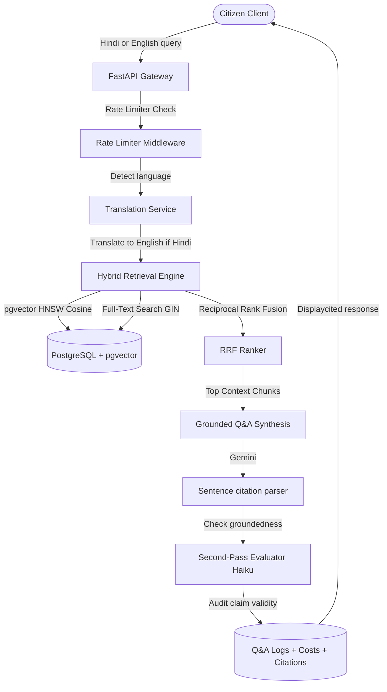

# Sahayak (government-scheme RAG assistant)

Sahayak is a production-grade, cited Retrieval-Augmented Generation (RAG) assistant and eligibility matchmaking engine designed to help citizens navigate complex Indian government scheme guidelines. The corpus currently covers **nine schemes**, each backed by a guideline document that was fetched live from its official government source, hashed, and provenance-recorded — no scheme is indexed on a document that wasn't actually and verifiably retrieved. See [`docs/corpus-audit.md`](docs/corpus-audit.md) for the full per-scheme audit.

Navigating scheme eligibility criteria involves handling scattered documents, complex rules (age limits, caste categories, income bands, land ownership restrictions), and language barriers. Sahayak addresses these challenges through a grounded assistant that synthesizes accurate answers, matches citizen demographics directly against guidelines, and audits claim veracity.

---

## Key Features

1. **Hybrid Retrieval Search Engine**: Combines Dense Vector Search (pgvector HNSW cosine distance) and Sparse Text Search (Postgres Full-Text Search) combined using Reciprocal Rank Fusion (RRF) for high-recall scheme document search.
2. **Grounded Answer Synthesis & Citations**: Generates answers with precise sentence-level inline citations linked directly to official government documents.
3. **Second-Pass Groundedness Evaluator**: Audits LLM claims against context sources, flagging unsupported or partially supported sentences with warning tags (⚠️) and descriptions.
4. **Structured Eligibility Engine**: Automatically matches citizen profiles against structured rules defined in the database (age limits, state residence, gender, caste, income, and agricultural landholding size).
5. **End-to-End Hindi Support**: Seamlessly translates Hindi input queries to English for backend retrieval, and synthesizes final answers directly in Hindi with correct citation mapping.
6. **Per-Request Cost Accounting & Rate Limiter**: Logs input/output token counts, computes actual API costs, and runs a sliding-window memory rate limiter (60 requests/min).

---

## System Architecture



---

## Evaluation Benchmark

Retriever and generator capabilities are tracked in `EVALS.md`.

> [!NOTE]
> Historical metrics measured on synthetic documents have been marked void in `EVALS.md`. A real baseline against the nine verified schemes requires a live `GEMINI_API_KEY` to run the full retrieval + generation harness (`eval/run_eval.py`); it has not yet been published for that reason — see `EVALS.md` for status.

---

## Installation & Setup

### Prerequisites
- Docker & Docker Compose
- Python 3.10+
- Node.js 18+ (npm)

### Step 1: Environment Variables
Create a `.env` file in the project root:
```bash
# Matches docker-compose.yml. For host-side runs use localhost:5433.
DATABASE_URL=postgresql+asyncpg://sahayak:sahayak_password@db:5432/sahayak
REDIS_URL=redis://redis:6379/0

# Mandatory. The app refuses to start if either is empty.
ADMIN_TOKEN=change-me-to-a-long-random-string
JWT_SECRET=change-me-to-a-different-long-random-string

# One key powers both chat and embeddings. https://aistudio.google.com/apikey
# Without it the app runs on mocks whose output is fabricated.
GEMINI_API_KEY=your-gemini-api-key-here

ENABLE_GROUNDEDNESS_CHECK=true
```

### Step 2: Boot Services
Start PostgreSQL, Redis, and the FastAPI backend:
```bash
# Spin up services inside Docker Compose
docker-compose --env-file .env up -d
```

### Step 3: Run Ingestion Pipeline
Seed the database, ingest guidelines, generate chunks/embeddings, and seed eligibility rules:
```bash
# Run migrations inside the API container
docker-compose --env-file .env exec api alembic upgrade head

# Ingest, chunk, and embed verified guidelines documents
docker-compose --env-file .env exec api python -m ingest.run

# Seed structured eligibility rules
docker-compose --env-file .env exec api python -m api.seed_eligibility
```

### Step 4: Run Tests & Evaluation
```bash
# Execute unit/integration test suite
docker-compose --env-file .env exec api pytest

# Execute evaluation harness
docker-compose --env-file .env exec api python -m eval.run_eval
```

---

## Technical Design Decisions

- **pgvector vs External Vector DB**: We chose pgvector to keep document Guidelines, Chunks, Embeddings, Schemes, Q&A Audit Logs, and Eligibility Rules in a single transactional Postgres database, eliminating sync latency and infrastructure overhead.
- **RRF (Reciprocal Rank Fusion)**: Combines dense embeddings (which capture semantics) and sparse keyword indices (which capture specific names like PM-KISAN).
- **Two-Pass Verification**: Using a fast Haiku-class model for sentence claim auditing separates factual synthesis from validation, protecting against hallucinations.

### Step 5: Run the Web Frontend
The frontend is a Next.js App Router application in `web/`:
```bash
npm install --prefix web
npm run --prefix web dev     # http://localhost:3000
```
It talks to the API at `http://localhost:8000` by default; override with
`NEXT_PUBLIC_API_BASE`.
