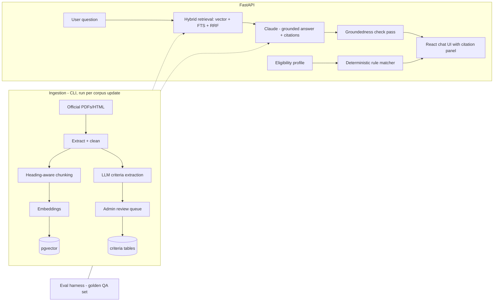

# Sahayak — AI Navigator for Government Schemes & Citizen Entitlements

> A multilingual RAG (retrieval-augmented generation) assistant that helps citizens discover government schemes they're eligible for and answers questions **with citations to official documents** — never from the model's imagination.
> Stack: **Python · FastAPI · PostgreSQL + pgvector · Claude API · React (TypeScript) · Docker**

**Skill area this demonstrates:** applied AI/LLM engineering done responsibly — chunking, hybrid retrieval, eval harnesses, hallucination control, structured extraction. This is what "AI engineer" roles actually interview on, and the social-impact framing gives it a genuine story.

---

## 1. The problem (big and real)

India runs 3,000+ central and state welfare schemes (scholarships, farmer subsidies, health insurance, housing, pensions). Billions of rupees go unclaimed every year because eligible citizens don't know a scheme exists, can't parse bureaucratic PDFs, or can't read the language they're published in. The same pattern exists in every country (US benefits, EU grants). Sahayak ingests official scheme documents and lets a user either **ask questions** ("My father is a farmer in Bihar with 2 acres — what can he get?") or fill a **guided eligibility profile** and get a ranked list of matching schemes — every answer cited, every citation clickable.

## 2. Why this stands out to recruiters

- RAG is the most in-demand LLM skill, and 95% of portfolio RAG projects are "chat with your PDF" toys with zero rigor. This one has **hybrid retrieval, an eval harness with scored metrics, and citation-grounding checks** — the three things that separate production RAG from a demo.
- The eligibility engine shows **structured LLM output** (extraction to JSON schema) combined with **deterministic rule evaluation** — you can explain exactly where the LLM is and isn't trusted.
- Meaningful mission → memorable interview story, credible README.

## 3. Feature scope

### MVP
- **Ingestion pipeline** (CLI): PDF/HTML scheme documents → clean text → semantic chunking (heading-aware, 400–800 tokens, overlap) → embeddings → pgvector; per-document metadata (scheme name, state, ministry, source URL, last-verified date)
- **Hybrid retrieval**: pgvector cosine similarity + Postgres full-text (BM25-style) merged with Reciprocal Rank Fusion; metadata filters (state, category)
- **Grounded Q&A chat**: retrieved chunks → Claude with a strict system prompt (answer only from context; say "I don't have this information" otherwise); inline numbered citations `[1]` mapping to source chunks with source URL + page; **groundedness check** — a second lightweight LLM pass verifies each claimed citation actually supports the sentence, flags unsupported sentences in the UI
- **Eligibility profiles**: guided form (age, state, occupation, income band, gender, category, disability, land holding) → deterministic matching against per-scheme structured criteria → ranked matches with "you qualify because…" / "you'd qualify if…" explanations
- **Criteria extraction pipeline**: LLM extracts each scheme's eligibility rules from its document into a JSON schema (`{minAge, maxIncome, states[], occupations[], …}`); extractions are stored with confidence + source quote and **human-reviewable** in an admin screen before going live
- **Evaluation harness** (`make eval`): 50+ hand-written QA pairs with gold answers/sources; reports Recall@5 (retrieval), citation precision, answer faithfulness (LLM-as-judge with pinned rubric); results table auto-written to `EVALS.md` — commit history shows metric improvements over time
- Multilingual: UI + answers in English and Hindi (answer language follows question language); documents stay English, retrieval query is translated first

### V2
- Voice input (browser speech-to-text) for low-literacy users
- WhatsApp bot interface (most-used app in target demographic) via webhook
- Document freshness monitoring: re-crawl source URLs, diff, flag stale schemes
- Add 2 more languages; add a second corpus (e.g., US federal benefits) to prove the pipeline is corpus-agnostic

### Out of scope
Auto-applying to schemes, storing government IDs (privacy — profiles are anonymous and local), scraping sites that prohibit it (use official open portals like myscheme.gov.in data).

## 4. Architecture



Key decisions (README material):
- **pgvector over a dedicated vector DB**: one database, transactional metadata + vectors together, honest scale reasoning (corpus is ~10⁵ chunks — Postgres is the right tool; note Qdrant as the 10⁷ path).
- **LLM extracts rules once (reviewed), deterministic code matches profiles** — eligibility answers are 100% reproducible and auditable; the LLM is never asked "is this user eligible" at runtime.
- **Groundedness as a first-class feature**: unsupported sentences get a visible warning badge, and the eval harness scores it. This is the #1 differentiator from toy RAG.
- Costs pinned: cheap model (Haiku-class) for extraction/judging, better model for user answers; per-request token accounting logged.

## 5. Data model (PostgreSQL)

```
documents(id, scheme_id, title, source_url, doc_type, lang, fetched_at, checksum)
chunks(id, document_id, seq, heading_path, text, tokens, embedding vector(1024), tsv tsvector)
schemes(id, name, state, ministry, category, summary, official_url, status)
criteria(id, scheme_id, field, op, value, source_quote, confidence, reviewed_by, reviewed_at)
   -- e.g. (scheme_x, 'annual_income', '<=', '200000', 'families with income below ₹2 lakh…', 0.93, …)
profiles(id, session_id, answers_json, created_at)          -- anonymous, no PII fields beyond form
matches(profile_id, scheme_id, verdict, missing_criteria_json, rank)
qa_logs(id, session_id, question, lang, retrieved_chunk_ids[], answer, citations_json,
        groundedness_json, latency_ms, tokens_in, tokens_out)
eval_cases(id, question, gold_answer, gold_chunk_ids[], category)
eval_runs(id, git_sha, ts, recall_at_5, citation_precision, faithfulness, notes)
```

## 6. Hard problems you'll solve (interview material)

1. **Chunking bureaucratic PDFs**: tables of eligibility criteria, multi-column layouts → heading-aware chunker with table-to-markdown conversion; show before/after retrieval recall in EVALS.md.
2. **Hybrid retrieval + RRF**: pure vector search misses exact scheme names/acronyms ("PM-KISAN"); FTS misses paraphrases; fusion fixes both — measured, not asserted.
3. **Hallucination control**: strict grounding prompt + citation verification pass + refusal path; eval metric proves it.
4. **LLM structured extraction you can trust**: JSON-schema-constrained output, confidence scoring, source-quote requirement, human review gate.
5. **Cross-lingual retrieval**: Hindi question → English corpus (query translation vs multilingual embeddings — implement one, benchmark, document the choice).

## 7. Build phases

| Phase | Deliverable | Acceptance criteria |
|---|---|---|
| 0 | Repo scaffold (api/, web/, ingest/, eval/), Docker Compose (pg+pgvector, api, web), CI, .env pattern for API keys | Compose up → API health + web shell load |
| 1 | Ingestion CLI for 20 real schemes from official portals; chunks + embeddings in pgvector | `make ingest` idempotent (checksum skip); chunk browser page shows clean chunks |
| 2 | Hybrid retrieval endpoint + RRF; eval harness with 50 golden QA cases scoring Recall@5 | `make eval` writes EVALS.md; Recall@5 ≥ 0.8 on golden set; RRF beats vector-only in the table |
| 3 | Grounded chat with citations UI; refusal on out-of-corpus questions | Manual probe set: 10 in-corpus answered w/ correct citations, 5 out-of-corpus refused; faithfulness ≥ 0.9 on eval |
| 4 | Groundedness verification pass + unsupported-sentence badges | Eval reports citation precision; seeded bad-citation case gets flagged in UI |
| 5 | Criteria extraction pipeline + admin review queue + deterministic matcher + profile form | Extraction on 20 schemes; matcher unit tests incl. "would qualify if" gaps; end-to-end profile → ranked matches |
| 6 | Hindi support, polish, token/cost logging, README with demo GIF + EVALS table, deploy | Hindi question returns Hindi grounded answer; README documents architecture + eval methodology |
| 7 (V2) | WhatsApp bot or voice input; freshness monitor | One V2 feature demoable end-to-end |

## 8. Resume bullet

> **Sahayak — Multilingual RAG Assistant for Government Scheme Discovery** | Python, FastAPI, PostgreSQL/pgvector, Claude API, React
> • Built a citation-grounded RAG system over official welfare-scheme documents using hybrid retrieval (vector + full-text with reciprocal rank fusion), achieving 0.8+ Recall@5 on a hand-built golden evaluation set with automated faithfulness scoring in CI.
> • Engineered a hallucination-control pipeline — strict grounding prompts, per-sentence citation verification, and explicit refusal paths — surfacing unsupported claims directly in the UI.
> • Combined LLM structured extraction (human-reviewed, source-quoted eligibility rules) with a deterministic rule engine to produce auditable, reproducible eligibility matches, including "you would qualify if" gap explanations in English and Hindi.
